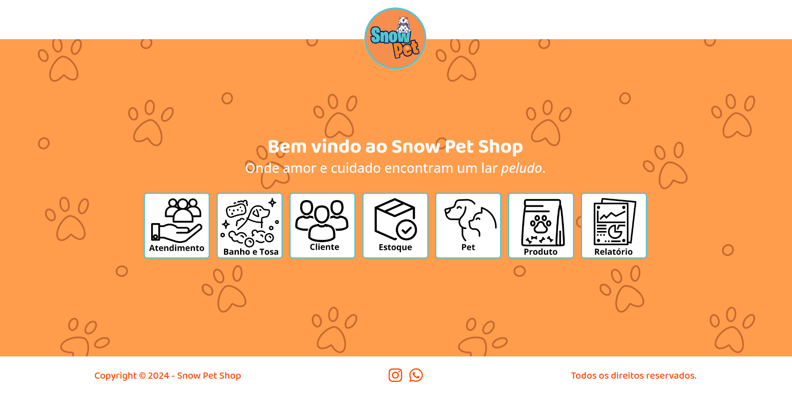

# Snow Pet - Pet Shop

O **Snow Pet Shop** é uma aplicação desenvolvida em React com TypeScript, criada para para gerenciar as operações de um pet shop, incluindo serviços de banho e tosa e a venda de produtos para pets. A aplicação faz integração com sua própria API desenvolvida em NestJS e utiliza diversas bibliotecas para gerenciamento de estado, requisições HTTP, estilização e componentes de UI.



## Tecnologias Utilizadas

- **React**: Biblioteca para construção de interfaces de usuário.
- **TypeScript**: Superset do JavaScript que adiciona tipos estáticos.
- **Vite**: Ferramenta de build rápida para projetos modernos.
- **Axios**: Cliente HTTP para realizar requisições.
- **Tanstack Query**: Biblioteca para gerenciamento de estado assíncrono e caching de dados.
- **Zustand**: Biblioteca para gerenciamento de estado no lado do cliente.
- **React Hook Form**: Biblioteca para gerenciamento e validação de formulários.
- **Zod**: Biblioteca para validação de esquemas e inferência de tipos.
- **MUI (Material-UI)**: Biblioteca de componentes de interface de usuário.
- **SASS**: Pré-processador CSS para estilização, utilizando mixins e variáveis.

## Funcionalidades

- Gerenciamento de pets.
- Gerenciamento de clientes.
- Controle de estoque de produtos.
- Registro de vendas e serviços de banho e tosa.
- Interface amigável e responsiva.

## Back-End

- [Snow Pet API](github.com/viniciussis/snow_pet_api)

## Pré-requisitos

Antes de rodar o projeto, certifique-se de ter as seguintes ferramentas instaladas em sua máquina:

- [Node.js](https://nodejs.org/en/download/)
- npm (geralmente vem com o Node.js) ou [Yarn](https://classic.yarnpkg.com/en/docs/install/)

## Instalação

1. **Clone o repositório:**

   ```bash
   git clone https://github.com/viniciussis/Snow_Pet.git
   cd Snow_Pet
   ```

2. **Instale as dependências:**

   ```bash
   npm install
   # ou
   yarn install
   ```

3. **Inicie o servidor de desenvolvimento:**
   ```bash
   npm run dev
   # ou
   yarn dev
   ```

## Estrutura do Projeto

A estrutura do projeto é a seguinte:

```
src/
├── api/            # Serviços para chamadas de API
├──── queries/      # Chamadas da API com React-Query
├── assets/         # Arquivos estáticos (imagens, fontes, estilos, etc.)
├──── styles/       # Arquivos SASS e mixins
├── components/     # Componentes reutilizáveis
├── hooks/          # Hooks personalizados
├──── stores/       # Stores do Zustand
├── pages/          # Páginas da aplicação
├── shared/         # Tudo o que é compartilhado pela aplicação
├──── constants/    # Constantes
├──── enums/        # Enums
├──── interfaces/   # Interfaces
├──── schemas/      # Zod Schemas
├── utils/          # Funções utilitárias
├── routes.tsx      # Roteamento da aplicação
├── main.tsx        # Ponto de entrada da aplicação
└── vite-env.d.ts   # Tipos do Vite
```

## Uso

Após iniciar o servidor de desenvolvimento, você pode acessar a aplicação no seu navegador em [http://localhost:5173](http://localhost:5173).

## Contribuição

Se você deseja contribuir com o projeto, siga os passos abaixo:

1. **Fork o repositório**
2. **Crie uma branch para a sua feature:** (`git checkout -b minha-feature`)
3. **Commit suas mudanças:** (`git commit -m 'Adicionei minha feature'`)
4. **Push para a branch:** (`git push origin minha-feature`)
5. **Abra um Pull Request**

## Licença

Este projeto está licenciado sob a [MIT License](LICENSE).
